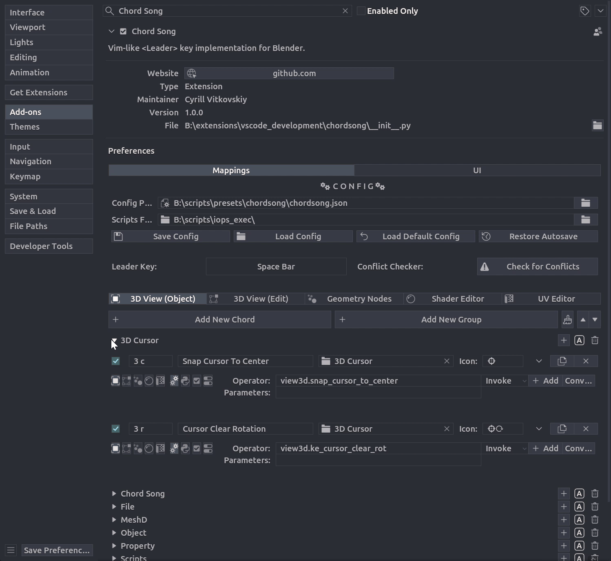
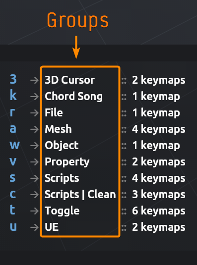

# Groups

Groups organize chord mappings into logical categories for easier management.

## Visual Organization

- **Preferences UI**: Collapsible sections let you fold/unfold groups to focus on specific categories.

- **Overlay Display**: When multiple mappings share a token prefix, the overlay shows which groups contain them.

## Creating Groups

Groups can be created:

1. **Manually**: Click **Add New Group** in the Mappings tab.
2. **Automatically**: Assigning a group name to a mapping creates the group if it doesn't exist. Unreal Engine style.
3. **From JSON**: Groups are created when loading mappings from a JSON file.

!!! tip "Naming Convention"
    Use descriptive names like "Editing" or "Navigation". Group names are case-sensitive.

## Group Management

### Adding Groups

1. Go to **Edit > Preferences > Extensions > Chord Song > Mappings**.
2. Click **Add New Group**.
3. Enter a group name.

### Removing Groups

1. Click the trash icon next to a group name.
2. If the group contains mappings, choose:
   - **Reassign**: Move mappings to another group.
   - **Clear**: Remove group assignment (mappings become "Ungrouped").
   - **Delete**: Permanently remove the group and all its mappings.

!!! warning "Deletion is Permanent"
    Cannot be undone. Consider reassigning mappings instead.

### Renaming Groups

Create a new group, remove the old one with the mappings reassigned to the new one.

### Cleaning Up Groups

The **Clean Up Groups** button (brush icon) automatically:

- Removes duplicate groups.
- Removes empty groups.

Use periodically to keep groups tidy, especially after importing configurations.

### Folding and Unfolding

- **Fold All**: Collapse all groups to show headers only.
- **Unfold All**: Expand all groups to show all mappings.

## Ungrouped Mappings

Mappings without a group assignment are placed in **"Ungrouped"**:

- Appears at the top of the list.
- Cannot be deleted (recreated automatically).
- Can be folded/unfolded like other groups.

Set the **Group** property when creating or editing a mapping to assign it to a group.

## Group Synchronization

Groups sync automatically with mappings:

- **Auto-creation**: Assigning a group name creates the group if it doesn't exist.
- **Auto-cleanup**: Cleanup removes groups not referenced by any mappings.
- **Name updates**: Renaming a group updates all mappings that reference it.

This keeps your group list consistent and prevents orphaned groups.
