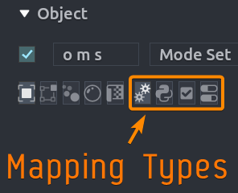

# Chord Mappings

Every chord mapping consists of the following properties:

- **Chord**: The key sequence (e.g., `g g`).
- **Label**: The name shown in the overlay.
- **Icon**: A font icon (Nerd Fonts) to display next to the label. Can be any symbol supported by the font.
- **Group**: Optional category to organize your overlay into sections.
- **Context**: The Blender editor where the mapping is active (3D View, Shader Editor, etc.).

## Adding Mappings

There are several ways to add chord mappings:

- **Preferences**: Manually add and edit mappings in the Chord Song preferences tab.
- **Context Menu**: Right-click any button or menu item in Blender and select **Add Chord Mapping**.
- **Info Panel**: Select operator history rows in Blender's Info Editor, right-click, and select **Extract to Chord Mapping** for batch creation.
- **Import/Append**: Load or merge configurations from JSON files (see [Import & Export](import_export.md)).
- **Manual Editing**: Advanced users can edit the JSON configuration file directly. See [Configuration File Format](import_export.md#configuration-file-format) for details.

## Mapping Types

Each chord mapping type has its own set of attributes and configuration options.

Mapping type can be switched by clicking one of the icons in the mapping item.

<!-- markdownlint-disable MD033 -->

<!-- markdownlint-enable MD033 -->

- [Operator Mapping](mappings/operator.md)
- [Property Mapping](mappings/property.md)
- [Toggle Mapping](mappings/toggle.md)
- [Script Mapping](mappings/script.md)
