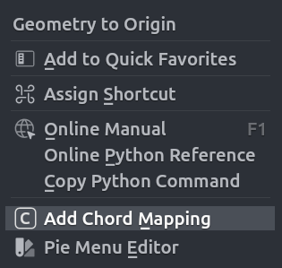
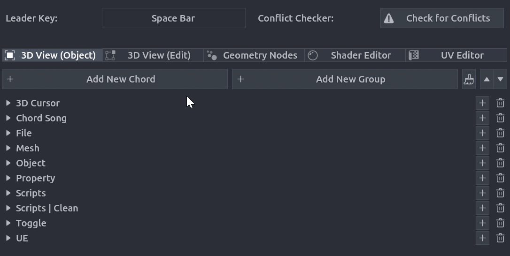

## Operator Mapping

You can map any blender operator to a chord if it's path starts with `bpy.ops.`.
There are three ways to add an operator mapping:

1. Use the right mouse menu on any operator in the 3D View, Shader Editor, UV Editor or Geometry Nodes editor.

    { width="240" }

2. Use the "Add Mapping" button in the Chord Song preferences panel.

    { width="640" }

3. Extract from the Info panel - select operator history text and use the context menu. See [Info Panel workflow](../../features/info.md) for details.

### Overview

Operator mappings execute Blender operators when their chord sequence is triggered.

### Creating Operator Mappings

<!-- TODO: Explain how to create operator mappings -->

### Operator ID

<!-- TODO: Explain operator ID format (e.g., object.shade_smooth) -->

### Operator Arguments

<!-- TODO: Explain how to pass arguments/kwargs to operators -->

### Common Operators

<!-- TODO: Provide examples of common operator mappings -->

### Finding Operator IDs

<!-- TODO: Explain how to discover operator IDs (context menu, info panel, etc.) -->
