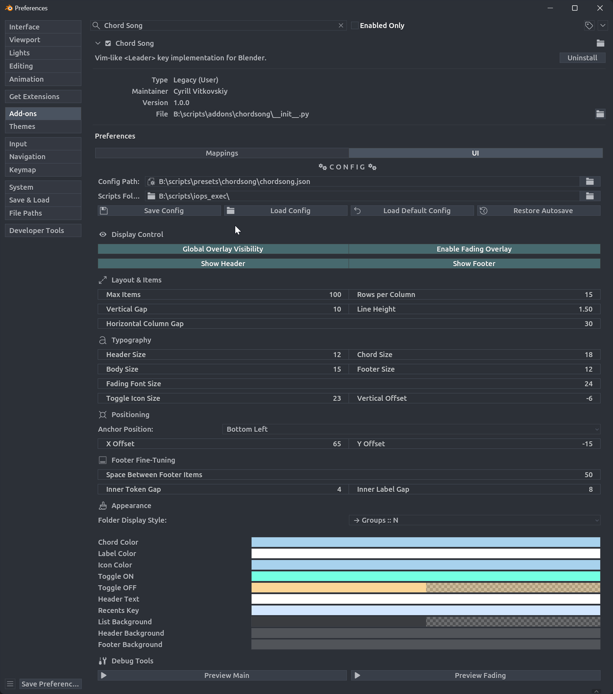
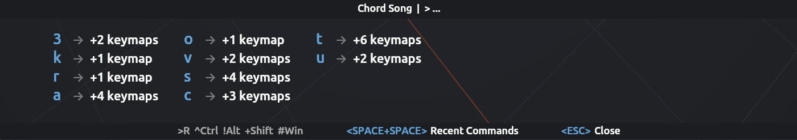
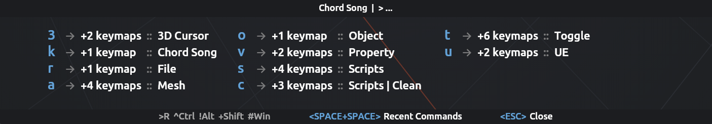
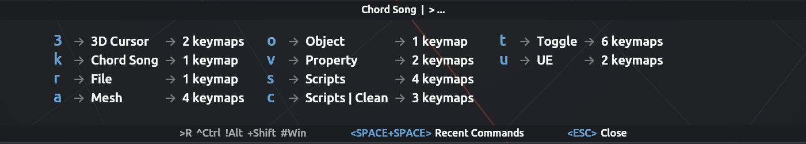
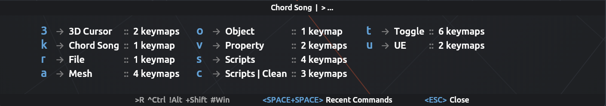

# Overlay Configuration

<!-- markdownlint-disable MD033 -->

<!-- markdownlint-enable MD033 -->

## Display Control

- **Global Overlay Visibility**: Toggle main overlay.
- **Enable Fading Overlay**: Show confirmation after executing a chord.
- **Show Header**: Toggle header.
- **Show Footer**: Toggle footer.

## Layout & Items

- **Max Items**: Items per column.
- **Column Layout**: Rows before wrapping.
- **Vertical Gap**: Item spacing.
- **Line Height**: Text line height multiplier.
- **Horizontal Column Gap**: Column spacing.

## Typography

- Font appearance settings

## Positioning

Controls overlay position.

- **Anchor Position**: Corner or edge anchor.
- **X Offset**, **Y Offset**: Offset from anchor.

## Appearance

- **Overlay Style**:
Choose one of the 4 styles:

<!-- markdownlint-disable MD033 -->

">
<!-- markdownlint-enable MD033 -->

- **Colors & Opacity**: Per-element colors (chord, label, icon, toggle states, backgrounds).

## Testing

**Debug Tools** in UI tab:

- **Preview Main**: Main overlay with dummy data.
- **Preview Fading**: Fading overlay (10s duration).

Click again to hide.
