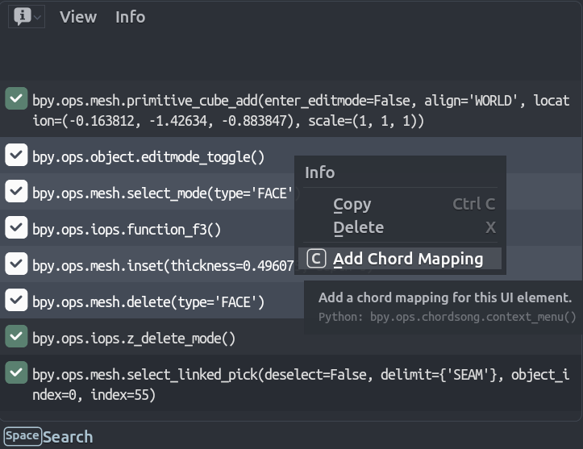
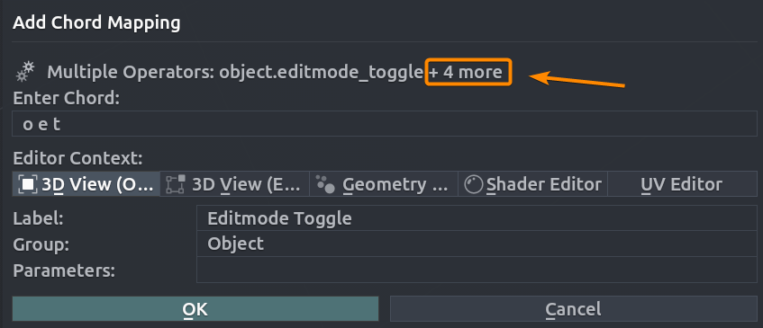

# Adding Chords from Info Panel

Create chord mappings from Blender's operator history.

<!-- markdownlint-disable MD033 -->

<!-- markdownlint-enable MD033 -->

## Workflow

### Step 1: Perform Actions

Execute operators or change properties. Each action appears in the Info panel:

**Operators:**
```
bpy.ops.mesh.primitive_cube_add()
bpy.ops.object.shade_smooth()
bpy.ops.transform.translate(value=(1, 0, 0))
```

**Properties:**
```
bpy.context.scene.cycles.use_denoising = True
bpy.context.space_data.overlay.show_wireframes = False
```

### Step 2: Select Text in Info Panel

1. Select one or more lines in the Info panel.
2. Right-click and choose **"Add Chord Mapping"**.

<!-- markdownlint-disable MD033 -->

<!-- markdownlint-enable MD033 -->

### Step 3: Configure the Mapping

- **Enter Chord**: The sequence of keys that will trigger the mapping.
- **Editor Context**: Context in which the mapping will be active.
- **Label**: Chord name.
- **Group**: Chord group.
- **Parameters**: Operator parameters.

Enter your chord sequence and adjust settings as needed.

## Batch Creation

Selecting multiple lines extracts all operators or properties. The first becomes the primary mapping; others are stored as sub-items. If a mix of operators and properties is detected, whichever type is detected first will filter out the other type, i.e. if the first line is an operator, the properties/toggles will be ignored and vice versa.
